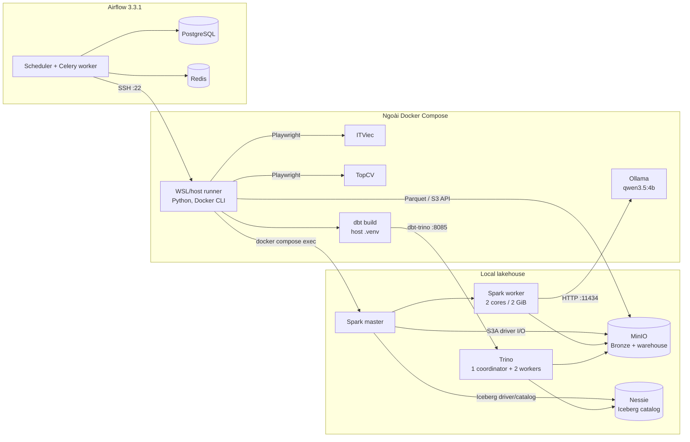
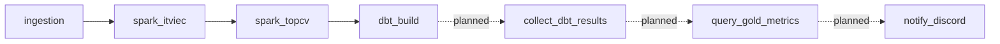

# CareerSignal

> Turning Job Data into Market Signals.

CareerSignal là pipeline dữ liệu tuyển dụng chạy local: thu thập tin IT từ
ITViec và TopCV, lưu dữ liệu thô vào MinIO, chuẩn hóa bằng Spark kết hợp
Ollama, quản lý bảng Iceberg qua Nessie, rồi dùng Trino và dbt để tạo các bảng
phân tích Gold.

Repository hiện hoàn thành luồng từ ingestion đến `dbt build`. Bước gửi báo
cáo qua Discord webhook là hạng mục kế tiếp và **chưa được triển khai**.

## Trạng thái dự án

| Khả năng | Trạng thái | Ghi chú |
|---|---|---|
| Crawl ITViec và TopCV | Đã có | Playwright chạy browser có giao diện trên host/WSL |
| Bronze trên MinIO | Đã có | Mỗi lần chạy tạo một snapshot Parquet mới theo ngày |
| Silver Iceberg | Đã có | Spark chuẩn hóa rồi `MERGE` theo `job_id` |
| Enrichment bằng Ollama | Đã có | Model `qwen3.5:4b`, một request cho mỗi record |
| Gold bằng dbt + Trino | Đã có | 7 table models trong schema `gold` |
| Orchestration bằng Airflow | Đã có | DAG tuần tự, một task và một DAG run tại một thời điểm |
| Gửi kết quả qua Discord | **Planned** | Chưa có webhook client, Airflow task, secret hay test |
| Data quality tests / CI | Chưa có | dbt chưa định nghĩa test hoặc source freshness |
| Production hardening | Chưa hoàn tất | Stack hiện phù hợp local development/portfolio |

## Mục lục

- [Kiến trúc](#kiến-trúc)
- [Luồng xử lý dữ liệu](#luồng-xử-lý-dữ-liệu)
- [Công nghệ và dịch vụ](#công-nghệ-và-dịch-vụ)
- [Cấu trúc repository](#cấu-trúc-repository)
- [Data contract](#data-contract)
- [Airflow DAG](#airflow-dag)
- [Yêu cầu môi trường](#yêu-cầu-môi-trường)
- [Cấu hình](#cấu-hình)
- [Cài đặt và khởi động](#cài-đặt-và-khởi-động)
- [Chạy pipeline](#chạy-pipeline)
- [Kiểm tra dữ liệu](#kiểm-tra-dữ-liệu)
- [Thiết kế Discord webhook còn thiếu](#thiết-kế-discord-webhook-còn-thiếu)
- [Quan sát và vận hành](#quan-sát-và-vận-hành)
- [Troubleshooting](#troubleshooting)
- [Giới hạn hiện tại và technical debt](#giới-hạn-hiện-tại-và-technical-debt)
- [Bảo mật](#bảo-mật)
- [Roadmap](#roadmap)

## Kiến trúc

### Kiến trúc đang chạy



Airflow không trực tiếp chạy crawler, Spark hoặc dbt trong container Airflow.
Mỗi task dùng `SSHOperator` kết nối ngược vào WSL/host qua connection
`pipeline_server`. Host sau đó:

1. chạy Python trong `.venv` để crawl và upload Bronze;
2. gọi Docker CLI để submit Spark job vào `spark-master`;
3. chạy `dbt build` trong `.venv` và kết nối Trino qua `localhost:8085`.

SSH user vì vậy phải truy cập được repository, `.venv`, Docker daemon, browser
display và các port local cần thiết.

### Luồng mục tiêu có Discord



Các node nét đứt chưa tồn tại trong source code. Tài liệu kiến trúc dài hạn nằm
tại [architechture.md](architechture.md); một số nội dung trong đó là roadmap,
không phải trạng thái triển khai hiện tại.

## Luồng xử lý dữ liệu

### 1. Ingestion

`ingestion.main` chạy tuần tự:

1. đăng nhập và crawl ITViec;
2. crawl danh mục Công nghệ thông tin của TopCV;
3. chuyển kết quả thành hai pandas DataFrame;
4. ghi Parquet tạm bằng PyArrow;
5. upload vào bucket `bronze` trên MinIO.

Object key hiện tại:

```text
s3://bronze/itviec/YYYY-M-D/<epoch>-ITViec.parquet
s3://bronze/topcv/YYYY-M-D/<epoch>-TopCV.parquet
```

Ngày trong key không zero-pad. Mỗi lần rerun trong cùng ngày tạo thêm một file
snapshot, không ghi đè file trước.

ITViec retry tối đa 5 lần cho HTTP `429`, `500`, `502`, `503`, `504`. TopCV ưu
tiên tiếp tục với dữ liệu partial khi một số trang lỗi; task ingestion do đó có
thể thành công dù snapshot TopCV rỗng hoặc chưa đầy đủ. Cần kiểm tra row count
sau mỗi lần chạy.

### 2. Bronze sang Silver

Hai Spark application chạy tuần tự và đọc **toàn bộ thư mục của ngày hiện
tại**:

```text
s3a://bronze/itviec/YYYY-M-D/
s3a://bronze/topcv/YYYY-M-D/
```

- ITViec: Ollama chuẩn hóa salary thành min/max, currency và period.
- TopCV: UDF `salary_parser_v4` chuẩn hóa salary; Ollama phân loại role,
  seniority, experience và skills.
- Cả hai tạo namespace `nessie.silver` nếu chưa có.
- Dữ liệu được `MERGE` vào Iceberg theo `job_id`: record cũ được update, record
  mới được insert.

Bảng đích:

```text
nessie.silver.itviec  -> s3a://warehouse/silver/itviec
nessie.silver.topcv   -> s3a://warehouse/silver/topcv
```

Nessie lưu catalog/commit history; data file và Iceberg metadata nằm trong
bucket `warehouse` của MinIO.

### 3. Silver sang Gold

dbt kết nối Trino bằng profile `Careersignal_dbt`, truy vấn hai bảng Silver và
materialize 7 table models trong schema `nessie.gold`. Phần lớn lineage dùng
`source()`/`ref()`; riêng `TheMostCVinData` còn tham chiếu trực tiếp
`silver.topcv`. Trino truy cập cùng Iceberg catalog Nessie và warehouse MinIO.

### 4. Notification

Pipeline hiện kết thúc khi `dbt_build` thành công. Chưa có bước đọc dbt artifact,
query các bảng Gold, format nội dung hoặc POST tới Discord webhook.

## Công nghệ và dịch vụ

| Thành phần | Phiên bản/cấu hình hiện tại | Vai trò | Port host |
|---|---|---|---|
| Python | CPython 3.11 | Crawler, upload, dbt CLI | — |
| Playwright | 1.61.0 | Browser automation | — |
| Airflow | 3.3.1, CeleryExecutor | Lập lịch và orchestration | `8081` |
| PostgreSQL | 16 | Airflow metadata/result backend | Internal only |
| Redis | 7.2 | Celery broker | Internal only |
| Spark | 3.5.9, Scala 2.12, Java 17 | Bronze → Silver | `7077`, UI `8080` |
| Spark worker | 1 worker, 2 cores, 2 GiB | Executor duy nhất | — |
| Iceberg runtime | 1.5.0 | Table format và `MERGE` | — |
| Nessie | 0.108.3, RocksDB | Versioned Iceberg catalog | `19120` |
| MinIO | `RELEASE.2025-09-07T16-13-09Z` | S3-compatible storage | API `9000`, console `9001` |
| Trino | 483 | SQL query engine | `8085` |
| dbt | Requirements pin Core 1.12.0, Trino adapter 1.10.3 | Silver → Gold | Qua Trino |
| Ollama | Chạy ngoài Compose | Local LLM serving | `11434` |
| LLM | `qwen3.5:4b` | Salary/role enrichment | Qua Ollama |

`spark-submit` tải Hadoop AWS, AWS SDK bundle và Iceberg runtime từ Maven ở lần
chạy đầu. Ivy cache nằm trong `/tmp` của `spark-master`, nên có thể phải tải lại
sau khi container được tạo lại.

dbt artifacts đang có trong workspace được tạo bằng Core 1.10.22 và adapter
Trino 1.10.3, trong khi `requirements.txt` pin Core 1.12.0. Sau fresh install,
chạy `dbt --version`, `dbt parse` và integration build để xác nhận bộ version
pin tương thích trước khi coi đây là tested runtime.

## Cấu trúc repository

```text
CareerSignal/
├── ingestion/
│   ├── ITViec.py                  # Crawler ITViec
│   ├── topcv.py                   # Crawler TopCV
│   └── main.py                    # Crawl và upload Bronze
├── spark-jobs/
│   ├── docker/                    # Spark image + requests
│   ├── parse_ITViec/              # Salary enrichment + Iceberg MERGE
│   ├── parse_topCV/               # Salary/role enrichment + MERGE
│   └── dataminin-spark.ipynb      # Notebook thử nghiệm cũ
├── Careersignal_dbt/
│   ├── models/ITviec/             # 2 dbt models
│   ├── models/TopCV/              # 5 dbt models
│   ├── models/source/             # Silver source definitions
│   ├── macros/
│   ├── dbt_project.yml
│   └── profiles.yml               # Local Trino profile
├── orchestration/
│   ├── dags/career_signal.py      # Airflow DAG
│   ├── config/airflow.cfg
│   └── logs/
├── trino/
│   ├── catalog/nessie.properties
│   ├── condinator/                # Coordinator config; tên hiện có của repo
│   └── Worker/                    # Hai worker configs
├── docker-compose.yml
├── logging_config.py
├── requirements.txt
├── architechture.md               # Target architecture / roadmap
└── README.md
```

`pipeline_upload.log`, `Careersignal_dbt/target/`, `Careersignal_dbt/logs/` và
notebook output là artifact local/generated. `topcv_it_jobs.csv` cũng là output
chẩn đoán generated nhưng đang được Git track như legacy artifact. Các file này
không phải source of truth của pipeline.

## Data contract

### Bronze: dữ liệu raw

#### ITViec

```text
job_id, slug, title, job_url, company_name, company_url, company_logo,
salary, job_category, working_model, location, skills, benefits, label,
posted_at, source_page, scraped_at
```

- `skills` và `benefits` là array trong Parquet.
- `scraped_at` là ISO timestamp UTC-aware.
- `job_url` và `company_url` được canonicalize và loại query string;
  `company_logo` không đi qua bước này.
- Deduplicate trong một crawl theo `job_id`, fallback `slug`.

#### TopCV

```text
job_id, source_page, position, tracking_id, box_type, title, company_name,
salary, city, experience, posted_time, updated_time, job_url, company_url,
logo_url, apply_text, apply_url, labels, visible_tags, remaining_tags,
is_hot, is_urgent, is_pro_company, is_verified, verification_level,
is_highlight, is_flash_job, is_diamond_employer, scraped_at
```

- `labels` và `visible_tags` là array; `remaining_tags` hiện là string.
- `scraped_at` là local naive timestamp.
- Deduplicate trong một crawl theo `job_id`, fallback `job_url`.
- Crawler ghi/overwrite `topcv_it_jobs.csv` nếu đi tới bước lưu. Khi lỗi sớm,
  file có thể không được tạo hoặc vẫn chứa dữ liệu cũ từ run trước.

### Silver: bảng Iceberg đã chuẩn hóa

#### `nessie.silver.itviec`

| Nhóm | Cột |
|---|---|
| Khóa | `job_id STRING` |
| Salary | `min_salary DOUBLE`, `max_salary DOUBLE`, `currency STRING`, `period STRING`, `parse_status STRING` |
| Job | `title`, `job_url`, `company_name`, `working_model`, `location` |
| Array | `skills ARRAY<STRING>`, `benefits ARRAY<STRING>` |
| Time | `posted_at STRING`, `scraped_at TIMESTAMP` |

Lỗi Ollama theo record không làm Spark job fail. Record có `job_id` hợp lệ vẫn
được giữ với salary null và `parse_status='failed'`; malformed/null key vẫn có
thể làm schema/join fail. Bảng này chưa lưu `parse_error` chi tiết.

#### `nessie.silver.topcv`

| Nhóm | Cột |
|---|---|
| Khóa/job | `job_id`, `job_url`, `title`, `city`, `company_name`, `apply_url`, `verification_level` |
| Salary | `salary_min`, `salary_max`, `salary_currency`, `salary_period`, `salary_parse_error` |
| Classification | `role_group`, `primary_role`, `secondary_roles ARRAY<STRING>`, `seniority`, `experience_years` |
| Skills/status | `skills ARRAY<STRING>`, `is_multi_role BOOLEAN`, `parse_status`, `parse_error` |
| Time | `scraped_at TIMESTAMP` |

TopCV salary parser nhận `triệu`, `tr`, `usd`, khoảng lương, “từ”, “tới” và
“thỏa thuận”. Format ngoài grammar ghi mã lỗi vào `salary_parse_error`; raw
`salary` chỉ còn ở Bronze. Có hai semantics hiện tại cần lưu ý: “tới X” tạo cả
`salary_min=salary_max=X`, và mọi handler đều trả `period=None`, nên
`salary_period` thực tế luôn null. Các field trung gian `salary_parse_status`,
`salary_type`, `salary_parser_version` chưa được ghi vào Silver cuối.

Ollama classification có trạng thái `success`, `ambiguous`,
`insufficient_information`, `error`. Lỗi từng record được ghi vào `parse_error`
nhưng không làm toàn Spark application fail.

### Gold: dbt models

| dbt model | Bảng/alias Gold | Ý nghĩa |
|---|---|---|
| `dataenginerr_career_in_itviec` | `career_data_engineer` | Tin ITViec liên quan Data Engineer/Data Engineering/Kỹ sư dữ liệu |
| `Most_skill_in_DE` | `skil_DE_need` | Top 10 skills theo số Data Engineer job distinct |
| `hiring_seniority` | `hiring_seniority` | Số TopCV job theo seniority |
| `Luong_trung_binh_IT` | `Luong_trung_binh_IT` | Trung bình min/max salary; USD đổi theo tỷ giá hard-code 26.000 VND |
| `phan_bo_viec_lam` | `phan_bo_viec_lam` | Phân bố job theo city |
| `TheMostCVinData` | `TheMostCVinData` | Số job và kinh nghiệm trung bình theo data role |
| `Trend_hiring` | `Trend_hiring` | Số lượng tuyển dụng theo primary role |

Lưu ý:

- tất cả model materialize thành `table`;
- chưa có generic/singular test, column description hoặc source freshness;
- `TheMostCVinData` tham chiếu trực tiếp `silver.topcv` thay vì `source()`, nên
  dbt lineage không nhận biết dependency;
- tỷ giá USD/VND là hằng số, chưa lấy theo ngày chạy;
- tên model/alias chưa thống nhất convention và ngôn ngữ.

## Airflow DAG

Source: [`orchestration/dags/career_signal.py`](orchestration/dags/career_signal.py)

| Thuộc tính | Giá trị |
|---|---|
| DAG ID | `career_signal_spark_pipeline` |
| Schedule | `@daily` |
| Timezone | `Asia/Ho_Chi_Minh` |
| Start date | `2026-08-21` |
| Catchup | `False` |
| Max active DAG runs | `1` |
| Max active tasks | `1` |
| Task timeout | `cmd_timeout=None` cho SSH command |
| Task retries | Chưa cấu hình |
| Connection | Airflow SSH connection `pipeline_server` |

Thứ tự hiện tại:

```text
ingestion >> spark_itviec >> spark_topcv >> dbt_build
```

Chạy tuần tự phù hợp cluster local chỉ có một Spark worker 2 core/2 GiB. Không
tăng concurrency trước khi tăng tài nguyên và kiểm tra tải Ollama.

Compose đặt `DAGS_ARE_PAUSED_AT_CREATION=true`; lần đầu cần unpause DAG trong
Airflow UI. Compose environment là cấu hình runtime có hiệu lực và override một
số giá trị trong `orchestration/config/airflow.cfg`.

## Yêu cầu môi trường

Topology hiện tại được xây quanh Windows + WSL2. Có thể port sang Linux nhưng
cần thay cách kết nối SSH, browser display và MinIO host endpoint.

### Bắt buộc

- Windows + WSL2/WSLg hoặc Linux có X server cho Playwright `headless=False`;
- Docker Engine/Docker Desktop và Docker Compose v2;
- Python 3.11;
- OpenSSH server trên host/WSL, reachable từ container Airflow;
- SSH user có quyền đọc repository, chạy `.venv` và dùng Docker daemon;
- Ollama trên host, model `qwen3.5:4b` đã pull;
- outbound internet cho website, Python packages và Maven artifacts;
- tài khoản ITViec được phép dùng cho crawler;
- đủ RAM/disk để Airflow, PostgreSQL, Redis, MinIO, Nessie, Spark, Trino và
  Ollama cùng chạy.

### Network bắt buộc

| Từ | Đến | Mục đích |
|---|---|---|
| Airflow containers | WSL/host `:22` | SSHOperator |
| Host ingestion | `172.22.176.1:9000` | MinIO API đang hard-code |
| Spark worker | `host.docker.internal:11434` | Ollama API |
| dbt trên host | `localhost:8085` | Trino |
| Spark/Trino containers | `minio:9000`, `nessie:19120` | Data và catalog |

`172.22.176.1` phụ thuộc máy hiện tại. Nếu WSL/Docker subnet đổi, ingestion sẽ
không kết nối MinIO dù container MinIO vẫn healthy. Nên chuyển endpoint thành
biến môi trường trong một thay đổi riêng.

## Cấu hình

### File `.env`

```bash
cp .env.example .env
```

Không commit `.env`. Template hiện chưa chứa toàn bộ biến mà Compose và DAG yêu
cầu; cần bổ sung các key còn thiếu:

```dotenv
# Job source
USER_NAME=job-board-login@example.com
PASS_WORD=replace-with-job-board-password

# Ingestion trên host
MINIO_USER=minioadmin
MINIO_PASSWORD=replace-with-a-strong-password

# MinIO container; current design cần cùng credential với hai biến trên
MINIO_ROOT_USER=minioadmin
MINIO_ROOT_PASSWORD=replace-with-a-strong-password

# Airflow SSH vào WSL/host
WSL_SSH_HOST=replace-with-a-host-reachable-from-docker
WSL_SSH_USER=replace-with-wsl-user
WSL_SSH_PASSWORD=replace-with-ssh-password
CAREER_SIGNAL_ROOT=/absolute/path/to/CareerSignal

# Airflow local
AIRFLOW_IMAGE_NAME=apache/airflow:3.3.1-python3.11
AIRFLOW_UID=50000
AIRFLOW_DB_USER=airflow
AIRFLOW_DB_PASSWORD=replace-with-a-strong-database-password
AIRFLOW_DB_NAME=airflow
AIRFLOW_ADMIN_USERNAME=airflow
AIRFLOW_ADMIN_PASSWORD=replace-with-a-strong-admin-password
AIRFLOW_FERNET_KEY=replace-with-a-valid-fernet-key
AIRFLOW_API_SECRET_KEY=replace-with-a-long-random-api-secret
AIRFLOW_JWT_SECRET=replace-with-a-long-random-jwt-secret
AIRFLOW_PARALLELISM=2
AIRFLOW_MAX_ACTIVE_TASKS_PER_DAG=2
AIRFLOW_CELERY_WORKER_CONCURRENCY=2
```

Ràng buộc:

- `CAREER_SIGNAL_ROOT` là path tuyệt đối trong SSH session, không phải path bên
  trong Airflow container.
- `WSL_SSH_HOST` không được là `localhost`; bên trong container, đó là chính
  container Airflow.
- `MINIO_USER/MINIO_PASSWORD` phải khớp MinIO. Compose lấy credential từ cặp
  `MINIO_ROOT_*` rồi map sang Spark/Trino.
- Fernet/API/JWT secret phải mạnh và riêng biệt; không dùng placeholder ngoài
  local test.
- Trên native Linux, đặt `AIRFLOW_UID` bằng giá trị số từ `id -u` để Airflow có
  quyền ghi bind mount `orchestration/logs`. Giá trị mặc định `50000` phù hợp
  Docker Desktop/local template nhưng không đảm bảo đúng owner ở mọi host.

Sinh ba secret hợp lệ bằng Python standard library rồi chép từng giá trị vào
`.env`:

```bash
python3.11 - <<'PY'
import base64
import secrets

print('AIRFLOW_FERNET_KEY=' + base64.urlsafe_b64encode(secrets.token_bytes(32)).decode())
print('AIRFLOW_API_SECRET_KEY=' + secrets.token_urlsafe(48))
print('AIRFLOW_JWT_SECRET=' + secrets.token_urlsafe(48))
PY
```

Mỗi lần chạy lệnh tạo bộ secret mới; không dùng lại output giữa các môi trường.

### Discord config dự kiến, chưa được code sử dụng

```dotenv
DISCORD_NOTIFICATIONS_ENABLED=false
DISCORD_CONN_ID=discord_webhook
DISCORD_USERNAME=CareerSignal
DISCORD_TIMEOUT_SECONDS=10
```

Không cần các biến trên để chạy pipeline hiện tại. `DISCORD_CONN_ID` chỉ định
Airflow Connection chứa webhook URL; URL thực không nên nằm trong `.env`, Git
hoặc log.

## Cài đặt và khởi động

### 1. Python environment

```bash
python3.11 -m venv .venv
source .venv/bin/activate
python -m pip install --upgrade pip
pip install -r requirements.txt
playwright install chromium
```

Dependencies được pin cho CPython 3.11. Chỉ đổi Python version sau khi kiểm thử
lại PySpark và toàn bộ dependency.

Nếu Ubuntu/WSL mới thiếu shared libraries của browser, dùng lệnh phù hợp quyền
quản trị của máy thay cho bước Playwright ở trên:

```bash
playwright install --with-deps chromium
```

### 2. SSH và browser display

Khởi động OpenSSH server theo hệ điều hành. Ví dụ trên WSL/Linux:

```bash
sudo service ssh start
```

Xác nhận SSH user:

- đăng nhập được từ Docker network;
- chạy được `docker compose ps` tại `CAREER_SIGNAL_ROOT`;
- chạy được executable trong `.venv`;
- có `DISPLAY`/WSLg trong non-interactive SSH session.

Thiết kế hiện dùng SSH password và chưa ép host-key verification, chỉ phù hợp
local. Production nên dùng SSH key, pin host key hoặc loại bỏ hop SSH.

### 3. Ollama

```bash
ollama pull qwen3.5:4b
curl -fsS http://localhost:11434/api/tags
```

Sau khi Spark worker chạy, kiểm tra từ executor:

```bash
docker compose exec -T spark-worker python3 -c \
  "import requests; print(requests.get('http://host.docker.internal:11434/api/tags', timeout=10).status_code)"
```

### 4. Start Docker Compose

```bash
touch pipeline_upload.log
docker compose config --quiet
docker compose up -d --build
docker compose ps
```

Cần tạo `pipeline_upload.log` như file trước Compose. File này bị Git ignore;
nếu source path chưa tồn tại, short bind mount có thể tạo một directory cùng
tên và làm Python logging lỗi `IsADirectoryError`.

Spark container chạy UID `185`, còn ingestion chạy bằng host user. Trên native
Linux, bảo đảm cả hai có quyền append file. Cách đơn giản chỉ dành cho local:

```bash
chmod 666 pipeline_upload.log
```

Với môi trường dùng chung, không để file world-writable; thay bằng ACL/group
riêng hoặc thiết kế lại logging mount. Đồng thời xác nhận UID ghi trong `.env`
bằng `id -u` và host user ghi được `orchestration/logs/` trước khi start Airflow.

Cảnh báo `version: '3.8' is obsolete` không phải lỗi khởi động. Không phải service
nào cũng có healthcheck, nên `running` chưa đảm bảo MinIO, Nessie, Spark hoặc
Trino đã ready.

### 5. Tạo MinIO bucket

Code ingestion chỉ tự tạo `bronze`. Repository không có service `minio-init` để
tạo `warehouse`; cần tạo bucket này trước Spark run đầu.

Dùng MinIO Console tại <http://localhost:9001> và tạo:

```text
bronze
warehouse
```

Hoặc dùng boto3 trong `.venv`:

```bash
.venv/bin/python - <<'PY'
import boto3
from dotenv import dotenv_values

cfg = dotenv_values('.env')
s3 = boto3.client(
    's3',
    endpoint_url='http://localhost:9000',
    aws_access_key_id=cfg['MINIO_ROOT_USER'],
    aws_secret_access_key=cfg['MINIO_ROOT_PASSWORD'],
    region_name='us-east-1',
)
existing = {item['Name'] for item in s3.list_buckets()['Buckets']}
for bucket in ('bronze', 'warehouse'):
    if bucket not in existing:
        s3.create_bucket(Bucket=bucket)
        print(f'created: {bucket}')
PY
```

### 6. Readiness

```bash
curl -fsS http://localhost:9000/minio/health/live
curl -fsS http://localhost:19120/api/v2/config
curl -fsS http://localhost:8085/v1/info
curl -fsS http://localhost:8081/api/v2/monitor/health
docker compose ps
```

Mở Spark UI tại <http://localhost:8080> và xác nhận một worker `ALIVE`, 2 cores,
2 GiB memory.

### 7. dbt connection

```bash
.venv/bin/dbt debug \
  --project-dir Careersignal_dbt \
  --profiles-dir Careersignal_dbt
```

Lệnh chạy trên host vì dbt profile kết nối `localhost:8085`.

## Chạy pipeline

### Bằng Airflow

1. Mở <http://localhost:8081>.
2. Đăng nhập bằng `AIRFLOW_ADMIN_USERNAME`/`AIRFLOW_ADMIN_PASSWORD`.
3. Tìm DAG `career_signal_spark_pipeline`.
4. Unpause DAG ở lần đầu.
5. Trigger thủ công hoặc chờ schedule `@daily`.
6. Theo dõi `ingestion` → `spark_itviec` → `spark_topcv` → `dbt_build`.

Không clear/retry Spark task ngay khi Airflow báo failed. Trước hết kiểm tra
Spark UI xem application cũ còn chạy không; SSH command không có timeout và
remote process có thể còn sống nếu Airflow worker/API gặp sự cố.

### Thủ công từng stage

Chạy từ repository root, đúng thứ tự sau.

#### Ingestion

```bash
CAREER_SIGNAL_ROOT="$(pwd)"
DISPLAY="${DISPLAY:-:0}" \
  "${CAREER_SIGNAL_ROOT}/.venv/bin/python" -m ingestion.main
```

#### Spark ITViec

```bash
docker compose exec -T spark-master /opt/spark/bin/spark-submit \
  --master spark://spark-master:7077 \
  --packages org.apache.hadoop:hadoop-aws:3.3.4,com.amazonaws:aws-java-sdk-bundle:1.12.262,org.apache.iceberg:iceberg-spark-runtime-3.5_2.12:1.5.0 \
  --conf spark.jars.ivy=/tmp/.ivy2-itviec \
  --conf spark.sql.extensions=org.apache.iceberg.spark.extensions.IcebergSparkSessionExtensions \
  --py-files /opt/spark-jobs/parse_ITViec/parse_job_ITviec.py \
  /opt/spark-jobs/parse_ITViec/parse_ITViec.py
```

#### Spark TopCV

```bash
docker compose exec -T spark-master /opt/spark/bin/spark-submit \
  --master spark://spark-master:7077 \
  --packages org.apache.hadoop:hadoop-aws:3.3.4,com.amazonaws:aws-java-sdk-bundle:1.12.262,org.apache.iceberg:iceberg-spark-runtime-3.5_2.12:1.5.0 \
  --conf spark.jars.ivy=/tmp/.ivy2-topcv \
  --conf spark.sql.extensions=org.apache.iceberg.spark.extensions.IcebergSparkSessionExtensions \
  --py-files /opt/spark-jobs/parse_topCV/parse_job_topCV.py,/opt/spark-jobs/parse_topCV/parse_salary_TOPCV.py \
  /opt/spark-jobs/parse_topCV/parse_topcv.py
```

#### dbt build

```bash
.venv/bin/dbt build \
  --project-dir Careersignal_dbt \
  --profiles-dir Careersignal_dbt
```

dbt cần hai bảng Silver tồn tại; Spark cần snapshot Bronze đúng ngày và bucket
`warehouse` đã được tạo.

Crawler độc lập để chẩn đoán:

```bash
DISPLAY="${DISPLAY:-:0}" .venv/bin/python -m ingestion.ITViec
DISPLAY="${DISPLAY:-:0}" .venv/bin/python -m ingestion.topcv
```

ITViec entry point ghi CSV local; TopCV chỉ ghi CSV nếu crawl đi tới bước lưu.
Nếu TopCV lỗi sớm, CSV cũ có thể vẫn còn và không chứng minh run mới thành công.
Luồng chính thức dùng `ingestion.main` và upload Parquet.

## Kiểm tra dữ liệu

### Catalog và table

```bash
docker compose exec -T trino-coordinator trino --execute "SHOW CATALOGS"
docker compose exec -T trino-coordinator trino --execute "SHOW SCHEMAS FROM nessie"
docker compose exec -T trino-coordinator trino --execute "SHOW TABLES FROM nessie.silver"
docker compose exec -T trino-coordinator trino --execute "SHOW TABLES FROM nessie.gold"
```

### Row count và parse quality

```bash
docker compose exec -T trino-coordinator trino --execute \
  "SELECT COUNT(*) AS rows FROM nessie.silver.itviec"

docker compose exec -T trino-coordinator trino --execute \
  "SELECT parse_status, COUNT(*) AS rows FROM nessie.silver.itviec GROUP BY 1 ORDER BY 2 DESC"

docker compose exec -T trino-coordinator trino --execute \
  "SELECT parse_status, COUNT(*) AS rows FROM nessie.silver.topcv GROUP BY 1 ORDER BY 2 DESC"

docker compose exec -T trino-coordinator trino --execute \
  "SELECT salary_parse_error, COUNT(*) AS rows FROM nessie.silver.topcv GROUP BY 1 ORDER BY 2 DESC"
```

Gold smoke test:

```bash
docker compose exec -T trino-coordinator trino --execute \
  "SELECT * FROM nessie.gold.skil_DE_need ORDER BY job_count DESC LIMIT 10"
```

Không dùng riêng Spark exit code làm data-quality gate: lỗi Ollama theo record
được chuyển thành trạng thái trong data và application vẫn có thể thành công.

## Thiết kế Discord webhook còn thiếu

### Trạng thái chính xác

Repository hiện **không có**:

- Discord webhook sender/client;
- query layer dành cho notification;
- formatter cho dbt result hoặc Gold metrics;
- Airflow task sau `dbt_build`;
- runtime secret/config cho Discord;
- retry, idempotency hoặc test cho notification.

Vì vậy `dbt_build` thành công sẽ không tự gửi Discord.

### Nội dung nên gửi

Không nên đẩy toàn bộ log dbt thô vào Discord. Message nên gồm:

1. **Execution summary** từ dbt artifacts:
   - DAG ID và `dag_run.run_id`;
   - start/end time, duration, overall status;
   - số model/test success, failed, skipped;
   - tên node lỗi và lỗi đã sanitize.
2. **Business summary** query qua Trino:
   - top skills cho Data Engineer;
   - tuyển dụng theo role/seniority và city;
   - salary min/max trung bình;
   - số Silver record parse failed/error.

Execution metadata nên đọc từ `run_results.json` kết hợp `manifest.json`;
business metrics phải query từ Trino sau dbt thành công. Hai artifact này không
tự chứa Airflow DAG ID/run ID, nên notification phải nhận metadata đó từ task
context và đối chiếu thêm dbt `invocation_id`.

dbt hiện chạy qua SSH trên host và ghi artifact ở
`Careersignal_dbt/target/`; thư mục này không được mount vào Airflow container.
Vì vậy collector cũng phải chạy trên cùng SSH host, hoặc dbt phải publish
artifact run-scoped vào storage dùng chung rồi chỉ truyền summary nhỏ qua XCom.
Không thiết kế một Python task trong container đọc trực tiếp host path này.

`target/run_results.json` bị ghi đè ở invocation kế tiếp, kể cả khi người dùng
chạy dbt thủ công ngoài Airflow. Khi triển khai nên truyền `--target-path` riêng
cho từng safe `dag_run.run_id`, collect ngay sau build và lưu `invocation_id` để
không gửi nhầm artifact của run khác.

Ví dụ logic, số liệu phải được query động:

```text
CareerSignal — SUCCESS
Run: scheduled__<logical-date>
dbt build: 7 models successful, 0 failed
Duration: <seconds>

Highlights
- Top Data Engineering skill: <skill> (<job_count> jobs)
- Top hiring role: <role> (<count> jobs)
- Top city: <city> (<count> jobs)
- Silver parse errors: ITViec <n>, TopCV <n>
```

### Task graph đề xuất

```text
dbt_build
  >> finalize_dbt_result [ALL_DONE]
       ├── success: collect artifact -> query Gold -> notify_success
       └── failure: Airflow state + artifact/log nếu có -> notify_failure
```

Graph tuyến tính mặc định sẽ skip downstream khi `dbt_build` fail. Finalizer
phải dùng trigger rule/callback phù hợp rồi rẽ nhánh theo upstream state. Failure
path không query Gold và phải fallback sang Airflow task state/exception vì lỗi
parse, profile hoặc connection có thể xảy ra trước khi dbt tạo artifact.

### Contract triển khai

| Hạng mục | Yêu cầu |
|---|---|
| Secret | Airflow Connection/secret backend; mask webhook trong log |
| HTTP | Timeout hữu hạn; chỉ `2xx` là thành công |
| Retry | Exponential backoff; tôn trọng `Retry-After` khi rate limited |
| Idempotency | Persistent send ledger/outbox với unique key `(dag_run.run_id, notification_type)` và payload hash |
| Payload | Escape/sanitize text, xử lý Unicode và empty result |
| Message size | Chia message/embed theo giới hạn Discord hiện hành |
| Failure policy | Data build không rollback chỉ vì notification lỗi; task có trạng thái riêng |
| Observability | Log request ID/status, không log webhook URL |
| Feature flag | `DISCORD_NOTIFICATIONS_ENABLED` hỗ trợ dry-run/disable |
| Testing | Mock HTTP success/timeout/429/5xx và test dedupe/formatter |

### Acceptance criteria

1. DAG success tạo đúng một message có run metadata và Gold metrics.
2. dbt failure tạo message có danh sách node lỗi.
3. Retry với lỗi xác định không tạo message trùng nhờ persistent ledger.
4. Webhook URL không xuất hiện trong Git, rendered template hoặc log.
5. Empty result, Unicode tiếng Việt, timeout, `429`, `5xx` đều có test.
6. Feature flag tắt thì không thực hiện HTTP request.
7. Task Discord nằm sau `dbt_build` và có runbook xử lý lỗi.

Discord webhook không cung cấp exactly-once key. Nếu POST đã tới Discord nhưng
client mất response, không thể đồng thời bảo đảm tuyệt đối “không trùng” và
“không mất” nếu không có giao thức xác nhận phía Discord. Implementation phải
chọn/document delivery semantics, lưu attempt state bền vững và xử lý ambiguous
network outcome theo policy vận hành.

## Quan sát và vận hành

### Endpoint

| Giao diện | URL |
|---|---|
| Airflow UI/API | <http://localhost:8081> |
| Spark master UI | <http://localhost:8080> |
| Trino UI/API | <http://localhost:8085> |
| MinIO Console | <http://localhost:9001> |
| MinIO API | <http://localhost:9000> |
| Nessie API config | <http://localhost:19120/api/v2/config> |
| Ollama API | <http://localhost:11434> |

### Log sources

- Airflow task logs: UI và `orchestration/logs/`;
- ingestion/Spark log: `pipeline_upload.log`;
- dbt: `Careersignal_dbt/logs/` và `Careersignal_dbt/target/`;
- service logs: Docker Compose;
- Spark application/allocation: Spark UI;
- query history: Trino UI.

```bash
docker compose logs -f --tail=200 airflow-worker airflow-scheduler airflow-apiserver
docker compose logs -f --tail=200 spark-master spark-worker
docker compose logs -f --tail=200 minio nessie trino-coordinator
```

`pipeline_upload.log` được nhiều process/container append vào cùng bind mount,
chưa có rotation/centralized logging. Timestamp host/container có thể khác
timezone.

### Dừng stack và persistent data

```bash
docker compose stop
docker compose down
```

`docker compose down` giữ named volumes:

- `minio-data`: Bronze, Iceberg data và metadata files;
- `nessie-data`: Nessie catalog/commit history;
- `airflow-postgres-data`: Airflow metadata.

Không dùng `docker compose down -v` nếu chưa chủ ý xóa toàn bộ dữ liệu local.
MinIO và Nessie cần backup nhất quán để tránh catalog trỏ đến object đã mất.

## Troubleshooting

| Triệu chứng | Nguyên nhân thường gặp | Kiểm tra/xử lý |
|---|---|---|
| DAG không xuất hiện/import error | Thiếu `CAREER_SIGNAL_ROOT` | Xem `airflow-dag-processor`, sửa `.env`, recreate service |
| SSH auth được nhưng command sai | User không thấy đúng path/không có Docker permission | SSH bằng cùng user, chạy `cd "$CAREER_SIGNAL_ROOT"`, `docker compose ps` |
| `No Host Key Verification` | Connection chưa pin host key | Chỉ chấp nhận local; production cấu hình known host/key auth |
| Playwright timeout/browser fail | Chromium hoặc DISPLAY/WSLg thiếu | `playwright install chromium`, kiểm tra `DISPLAY` và X server |
| Ingestion không kết nối MinIO | `172.22.176.1:9000` không còn đúng | Kiểm tra subnet/health; đưa endpoint ra env trong thay đổi sau |
| `NoSuchBucket: warehouse` | Bucket chưa bootstrap | Tạo `warehouse` trước Spark run |
| Spark chờ executor | Worker chưa ALIVE hoặc core bị app khác giữ | Xem Spark UI; không chạy hai Spark task song song |
| Spark lần đầu rất chậm | Đang tải Maven JAR | Kiểm tra network và Ivy log |
| Nhiều parse failed/error | Ollama unreachable/model thiếu/timeout | Gọi `/api/tags` từ `spark-worker`, xem pipeline log |
| Rerun cùng ngày càng lag | Spark đọc lại mọi snapshot, chưa dedupe | Tránh ingestion rerun không cần thiết; xem technical debt |
| TopCV rỗng nhưng ingestion xanh | Crawler trả partial/empty sau lỗi được bắt | Kiểm tra log và Bronze row count; CSV có thể là artifact cũ |
| Spark không thấy folder | Host local date khác container timezone | So sánh Bronze key với ngày Spark đọc |
| Airflow đỏ, Spark vẫn chạy | API/DNS/SSH đứt, remote process còn sống | Xem worker/api-server log và Spark UI trước retry |
| dbt không thấy Silver | Spark/Nessie/Trino chưa ready hoặc warehouse thiếu | `SHOW TABLES FROM nessie.silver`, kiểm tra service logs |
| dbt xong nhưng Discord im lặng | Discord chưa triển khai | Đây là trạng thái hiện tại |

## Giới hạn hiện tại và technical debt

### Ưu tiên cao

1. **Snapshot/duplicate:** mỗi ingestion thêm file; Spark đọc lại cả folder và
   chưa `dropDuplicates`. Một `job_id` lặp N lần có thể bị gọi Ollama N lần;
   join parsed/raw theo key có thể tạo N×N record trước `MERGE`.
2. **Date/time:** ingestion dùng local time host, Spark dùng clock/timezone
   container; ITViec timestamp UTC-aware, TopCV local-naive. Gần nửa đêm có thể
   upload ngày D nhưng Spark đọc D-1.
3. **MinIO endpoint hard-code:** `ingestion/main.py` dùng
   `http://172.22.176.1:9000`.
4. **Bucket bootstrap:** chỉ `bronze` được ingestion tự tạo.
5. **Notification:** DAG dừng ở `dbt_build`.

### Data quality và reliability

- một Ollama HTTP call/record, timeout 180 giây, không retry/backoff;
- 8 Spark partitions nhưng cluster chỉ có 2 executor cores;
- lỗi Ollama theo row không làm Spark task fail;
- TopCV có thể trả partial/empty và ingestion exit 0;
- DAG chưa có retry; SSH command không timeout;
- không có dbt tests, freshness, schema contract hoặc row-count gate;
- dbt dùng tỷ giá hard-code và một model bypass `source()`;
- chưa có unit/integration/end-to-end test hoặc CI.

### Hạ tầng

- nhiều service không có healthcheck; `depends_on` không đảm bảo readiness;
- không có resource limit toàn stack;
- Maven/Ivy cache không persistent;
- Airflow dùng SSH password, chưa pin host key;
- Trino dùng auth `none`, Nessie auth `NONE`; MinIO có access/secret auth nhưng
  pipeline dùng root credential qua HTTP, chưa có TLS hoặc least privilege;
- log chưa rotation, remote storage hoặc alerting;
- notebook Spark cũ dùng plain Parquet, không đại diện production path Iceberg.

## Bảo mật

Stack hiện là local development, chưa phải production-secure deployment.

- Không commit `.env`, job-board password, MinIO credential, SSH password hoặc
  Discord webhook URL.
- Rotate default/secret từng xuất hiện trong config trước khi dùng ngoài máy cá
  nhân.
- Dùng Airflow secret backend/Connection; tránh render secret trong command.
- Chuyển SSH password sang key auth, pin host key, áp dụng least privilege cho
  Docker access.
- Giới hạn firewall cho `8080`, `8081`, `8085`, `9000`, `9001`, `19120`.
- Bật TLS cho các service; thêm auth cho Trino/Nessie và dùng scoped service
  credential thay cho MinIO root credential trước khi expose.
- Không log credential, webhook URL hoặc dữ liệu nhạy cảm từ job board.
- Chỉ crawl bằng tài khoản được phép; tuân thủ điều khoản, rate limit và quy
  định dữ liệu của nguồn.

## Kiểm tra trước khi merge

Repository chưa có test suite tự động. Static validation tối thiểu:

```bash
docker compose config --quiet
.venv/bin/python -m compileall ingestion spark-jobs orchestration/dags
.venv/bin/dbt parse --project-dir Careersignal_dbt --profiles-dir Careersignal_dbt
```

Integration validation cần stack, hai bảng Silver và sẽ materialize/replace các
bảng Gold trong local lakehouse:

```bash
.venv/bin/dbt build --project-dir Careersignal_dbt --profiles-dir Careersignal_dbt
```

Với thay đổi data model:

1. cập nhật properties và column descriptions;
2. thêm `not_null`, `unique`, `accepted_values`/relationship tests phù hợp;
3. xác nhận schema Silver/Gold bằng Trino;
4. kiểm tra retry cùng ngày để phát hiện duplicate;
5. cập nhật README và Discord metric contract nếu output đổi.

## Roadmap

### P0 — Ổn định pipeline

- đưa MinIO/Ollama endpoint, model và timezone vào cấu hình;
- bootstrap bucket với healthcheck/idempotency;
- xử lý một snapshot/run thay vì toàn bộ folder ngày;
- deduplicate trước Ollama, join và Iceberg `MERGE`;
- thống nhất UTC, truyền Airflow `logical_date` xuống mọi stage;
- thêm row-count/data-quality gates cho partial crawl.

### P1 — Discord reporting

- đọc dbt `run_results.json`/`manifest.json`;
- query Gold KPI qua Trino;
- format success/failure payload;
- quản lý webhook bằng Airflow secret/Connection;
- thêm retry, rate-limit handling, idempotency và tests;
- nối task Discord sau `dbt_build`.

### P2 — Quality và observability

- thêm dbt source/model tests, descriptions và freshness;
- chuẩn hóa model/alias naming;
- sửa lineage `TheMostCVinData`, externalize exchange rate;
- structured logging, rotation, metrics và alerting;
- bỏ `topcv_it_jobs.csv` legacy khỏi Git tracking và quản lý artifact đúng chỗ;
- DAG/task timeout, retry policy, stale remote-job cleanup;
- unit/integration/end-to-end tests trong CI.

### P3 — Production hardening

- bỏ SSH hop hoặc dùng dedicated runner;
- secret backend, TLS, authentication, network isolation;
- persistent dependency cache, resource quotas và scaling phù hợp;
- backup/restore drill cho MinIO, Nessie và Airflow metadata;
- triển khai target cloud architecture sau khi local pipeline ổn định.

## Đóng góp

- Giữ Bronze backward-compatible hoặc ghi rõ migration.
- Không đổi Silver/Gold schema mà không cập nhật dbt và data contract.
- Không tăng Airflow/Spark concurrency nếu chưa đo tài nguyên.
- Không commit log, credential, local data, generated artifact hoặc webhook.
- Pull request cần có lệnh kiểm thử và cập nhật runbook liên quan.

## License

Repository chưa có file `LICENSE`. Không mặc định suy ra quyền sử dụng, phân
phối hoặc sửa đổi ngoài phạm vi chủ sở hữu cho phép. Thêm license rõ ràng trước
khi public hoặc phân phối dự án.
