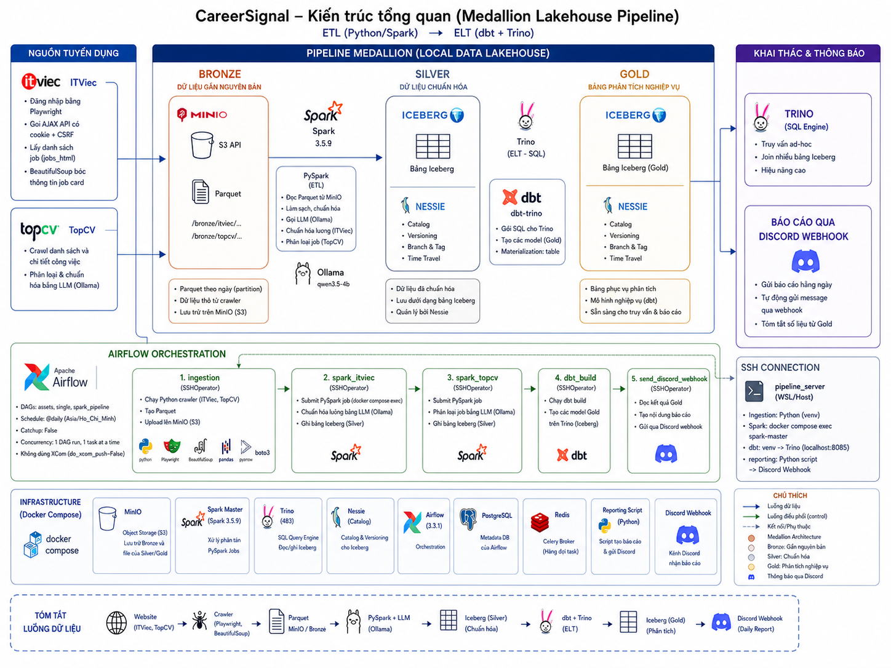
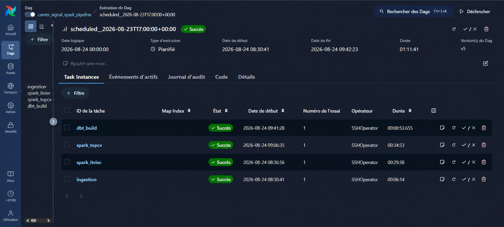

# CareerSignal

> Turning Job Data into Market Signals.

## Giới thiệu dự án

CareerSignal là pipeline dữ liệu tuyển dụng được xây dựng để thu thập tin việc
làm IT từ ITViec và TopCV, chuẩn hóa dữ liệu rồi tạo các bảng phân tích về nhu
cầu tuyển dụng, kỹ năng, cấp bậc, kinh nghiệm, mức lương và địa điểm.

Dự án được triển khai dưới dạng một Medallion Lakehouse chạy local:

- **Bronze:** Playwright thu thập dữ liệu từ website, pandas/PyArrow chuyển dữ
  liệu thành Parquet và boto3 upload lên MinIO.
- **Silver:** PySpark làm sạch và chuẩn hóa dữ liệu. Ollama với model
  `qwen3.5:4b` hỗ trợ chuẩn hóa lương ITViec và phân loại công việc TopCV. Dữ
  liệu được lưu thành bảng Apache Iceberg do Nessie quản lý.
- **Gold:** dbt gửi các câu SQL tới Trino để tạo các bảng phân tích nghiệp vụ.
- **Orchestration:** Airflow chạy tuần tự ingestion, hai Spark job và
  `dbt build` thông qua `SSHOperator`.

Pipeline hiện đã hoàn thành luồng từ ingestion đến các bảng Gold. Chức năng
tổng hợp kết quả và gửi báo cáo qua Discord webhook là hướng phát triển tiếp
theo, chưa có trong DAG đang chạy.

## Cấu trúc thư mục

```text
CareerSignal/
├── ingestion/
│   ├── ITViec.py                  # Đăng nhập, crawl và parse job card ITViec
│   ├── topcv.py                   # Crawl và parse job card TopCV
│   └── main.py                    # Tạo Parquet và upload lớp Bronze lên MinIO
├── spark-jobs/
│   ├── parse_ITViec/              # Chuẩn hóa lương ITViec và MERGE vào Silver
│   ├── parse_topCV/               # Parse lương, phân loại job và MERGE Silver
│   ├── docker/                    # Docker image và dependency cho Spark
│   └── dataminin-spark.ipynb      # Notebook thử nghiệm Spark, không thuộc DAG
├── Careersignal_dbt/
│   ├── models/ITviec/             # Các model Gold từ dữ liệu ITViec
│   ├── models/TopCV/              # Các model Gold từ dữ liệu TopCV
│   ├── models/source/             # Khai báo hai bảng Silver cho dbt
│   ├── macros/                    # Macro tùy chỉnh cách đặt schema
│   ├── dbt_project.yml            # Cấu hình dbt project
│   └── profiles.yml               # Kết nối dbt tới Trino local
├── orchestration/
│   ├── dags/                      # DAG Airflow điều phối pipeline
│   ├── config/                    # Cấu hình Airflow
│   └── logs/                      # Log task Airflow trên máy local
├── trino/
│   ├── catalog/                   # Cấu hình Iceberg catalog dùng Nessie/MinIO
│   ├── condinator/                # Cấu hình Trino coordinator của repository
│   └── Worker/                    # Cấu hình hai Trino worker
├── docs/images/                   # Ảnh kiến trúc và ảnh theo dõi Airflow
├── docker-compose.yml             # Khởi tạo toàn bộ hạ tầng local
├── logging_config.py              # Cấu hình log dùng chung
├── requirements.txt               # Dependency Python chạy trên host
└── README.md
```

## Kiến trúc tổng quan



Sơ đồ mô tả kiến trúc Medallion Lakehouse và hướng mở rộng báo cáo qua Discord.
Ở phiên bản hiện tại, luồng từ crawler đến các bảng Gold cùng bốn Airflow task
đầu tiên đã được triển khai. `Reporting Script`, `send_discord_webhook` và
Discord webhook trong hình là thành phần **planned**, chưa tham gia pipeline
đang chạy.

### Vai trò của các thành phần

| Thành phần | Vai trò |
|---|---|
| Python, Playwright, BeautifulSoup | Thu thập và bóc dữ liệu job card |
| pandas, PyArrow | Tạo DataFrame và snapshot Parquet |
| boto3 | Ghi Parquet lên MinIO qua S3 API |
| MinIO | Object storage chứa Bronze và file vật lý của Silver/Gold |
| Spark 3.5.9 | Xử lý Bronze, gọi Ollama và ghi Silver |
| Ollama `qwen3.5:4b` | Chuẩn hóa lương và phân loại nội dung tuyển dụng |
| Apache Iceberg | Định dạng bảng, snapshot và hỗ trợ `MERGE` |
| Nessie | Catalog và lịch sử commit của bảng Iceberg trên branch `main` |
| Trino 483 | SQL engine truy vấn các bảng Iceberg |
| dbt | Quản lý SQL model và materialize các bảng Gold |
| Airflow 3.3.1 | Lập lịch, điều phối và theo dõi task |
| PostgreSQL, Redis | Metadata database và Celery broker của Airflow |
| Docker Compose | Khởi tạo hạ tầng lakehouse local |

## Luồng xử lý dữ liệu

```text
ITViec + TopCV
      ↓  Playwright / BeautifulSoup
MinIO Bronze (Parquet)
      ↓  PySpark + parser + Ollama
Iceberg Silver, catalog Nessie
      ↓  Trino + dbt
7 bảng Iceberg Gold
      ↓
Truy vấn và phân tích
```

### 1. Ingestion và lớp Bronze

`ingestion.main` thực hiện tuần tự:

1. Đăng nhập và crawl danh sách việc làm trên ITViec.
2. Crawl danh mục Công nghệ thông tin toàn quốc trên TopCV.
3. Chuyển kết quả thành hai pandas DataFrame.
4. Ghi DataFrame thành Parquet tạm bằng PyArrow.
5. Upload Parquet vào bucket `bronze` trên MinIO.

Đường dẫn snapshot:

```text
s3://bronze/itviec/YYYY-M-D/<timestamp>-ITViec.parquet
s3://bronze/topcv/YYYY-M-D/<timestamp>-TopCV.parquet
```

Mỗi lần chạy tạo một file mới. Bronze lưu dữ liệu đã bóc từ job card nhưng vẫn
giữ các trường như salary và experience ở dạng text gần nguyên bản.

Các nhóm dữ liệu chính:

- ITViec: job, công ty, salary, hình thức làm việc, địa điểm, skills, benefits
  và thời điểm crawl.
- TopCV: job, công ty, salary, thành phố, kinh nghiệm, tag, link ứng tuyển và
  các cờ như hot, urgent hoặc verified.

### 2. Spark ITViec: Bronze sang Silver

Spark đọc toàn bộ Parquet trong thư mục ITViec của ngày hiện tại. Các trường
`job_id` và `salary` được chia thành tám partition rồi gửi từng record tới
Ollama để tạo:

```text
min_salary, max_salary, currency, period, parse_status
```

Kết quả được join lại với nội dung job và `MERGE` theo `job_id` vào:

```text
nessie.silver.itviec
s3a://warehouse/silver/itviec
```

Job đã tồn tại được update; job mới được insert.

### 3. Spark TopCV: Bronze sang Silver

TopCV có hai nhánh xử lý:

- `salary_parser_v4` chuẩn hóa các dạng khoảng lương, `từ`, `tới`, `triệu`,
  `tr`, `USD` và `thỏa thuận`.
- Ollama đọc title, tag và experience để tạo `role_group`, `primary_role`,
  `secondary_roles`, `seniority`, `experience_years`, `skills` và trạng thái
  parse.

Hai nhánh được join theo `job_id` rồi `MERGE` vào:

```text
nessie.silver.topcv
s3a://warehouse/silver/topcv
```

### 4. dbt và lớp Gold

dbt kết nối Trino tại `localhost:8085`, đọc `nessie.silver.itviec` và
`nessie.silver.topcv`, sau đó materialize bảy bảng trong schema `nessie.gold`.

| Bảng Gold | Nội dung |
|---|---|
| `career_data_engineer` | Các job ITViec có title liên quan Data Engineer |
| `skil_DE_need` | Top 10 kỹ năng theo số Data Engineer job distinct |
| `hiring_seniority` | Số lượng TopCV job theo seniority |
| `Luong_trung_binh_IT` | Trung bình salary min/max sau khi đổi USD theo tỷ giá 26.000 VND |
| `phan_bo_viec_lam` | Phân bố số lượng job theo thành phố |
| `TheMostCVinData` | Kinh nghiệm trung bình và tổng job theo Data role |
| `Trend_hiring` | Số lượng tuyển dụng theo primary role |

## Điều phối và theo dõi bằng Airflow

DAG `career_signal_spark_pipeline` chạy hằng ngày theo múi giờ
`Asia/Ho_Chi_Minh`. Bốn task được thực thi tuần tự:

```text
ingestion → spark_itviec → spark_topcv → dbt_build
```

| Task | Nội dung |
|---|---|
| `ingestion` | Chạy crawler, tạo Parquet và upload Bronze |
| `spark_itviec` | Submit Spark job chuẩn hóa dữ liệu ITViec |
| `spark_topcv` | Submit Spark job chuẩn hóa và phân loại TopCV |
| `dbt_build` | Chạy dbt để tạo các bảng Gold qua Trino |

Mỗi task dùng `SSHOperator` kết nối tới WSL/host qua Airflow connection
`pipeline_server`. DAG đặt `catchup=False`, `max_active_runs=1` và
`max_active_tasks=1`, vì vậy các bước không chạy song song ở cấp Airflow.

Airflow UI cho phép theo dõi trạng thái, thời gian bắt đầu, thời gian kết thúc,
thời lượng, số lần thử và log của từng task. Ảnh dưới đây minh họa một DAG run
thành công, trong đó cả bốn task đều hoàn thành:



Pipeline không truyền job data qua XCom. Task sau đọc output của task trước từ
MinIO hoặc bảng Iceberg. Hiện DAG chưa cấu hình task retry hoặc execution
timeout; task lỗi sẽ chặn các task phía sau.

## Yêu cầu môi trường

Topology hiện tại được phát triển cho Windows với WSL2. Máy chạy cần có:

- Python 3.11 và một virtual environment tại `.venv`.
- Docker Engine và Docker Compose.
- OpenSSH server trên WSL/host để Airflow kết nối ngược vào host.
- Chromium cho Playwright và display/WSLg vì crawler chạy `headless=False`.
- Ollama chạy trên host cùng model `qwen3.5:4b`.
- Tối thiểu khoảng 8 GiB RAM trống cho stack local.

Các cổng mặc định:

| Dịch vụ | Địa chỉ |
|---|---|
| Airflow UI/API | `http://localhost:8081` |
| Spark UI | `http://localhost:8080` |
| MinIO API | `http://localhost:9000` |
| MinIO Console | `http://localhost:9001` |
| Nessie API | `http://localhost:19120` |
| Trino | `http://localhost:8085` |
| Ollama | `http://localhost:11434` |

## Cấu hình

Tạo file `.env` tại thư mục gốc. Không commit credential thật.

```dotenv
# MinIO
MINIO_ROOT_USER=<minio-admin-user>
MINIO_ROOT_PASSWORD=<minio-admin-password>
MINIO_USER=<minio-user-for-ingestion>
MINIO_PASSWORD=<minio-password-for-ingestion>

# ITViec
USER_NAME=<itviec-email>
PASS_WORD=<itviec-password>

# Airflow SSH connection tới WSL/host
WSL_SSH_HOST=<wsl-host-address>
WSL_SSH_USER=<wsl-user>
WSL_SSH_PASSWORD=<wsl-password>
CAREER_SIGNAL_ROOT=/absolute/path/to/CareerSignal

# Airflow local
AIRFLOW_UID=50000
AIRFLOW_ADMIN_USERNAME=airflow
AIRFLOW_ADMIN_PASSWORD=<airflow-admin-password>
```

`ingestion/main.py` hiện dùng MinIO endpoint hard-code
`http://172.22.176.1:9000`. Nếu địa chỉ WSL/Windows host khác, cần cập nhật
endpoint này trước khi chạy ingestion.

## Cài đặt

### 1. Cài dependency Python trên host

```bash
python3.11 -m venv .venv
source .venv/bin/activate
pip install --upgrade pip
pip install -r requirements.txt
playwright install chromium
```

`requirements.txt` chỉ chứa dependency trực tiếp cho crawler và dbt trên host.
PySpark có sẵn trong Spark image; `requests` dành cho Spark executor nằm trong
`spark-jobs/docker/requirements.txt`; Airflow và provider chạy trong Airflow
image của Docker Compose.

### 2. Chuẩn bị Ollama

```bash
ollama pull qwen3.5:4b
curl -fsS http://localhost:11434/api/tags
```

Spark worker gọi Ollama trên host qua
`http://host.docker.internal:11434/api/chat`.

### 3. Khởi động hạ tầng

```bash
docker compose build spark-master spark-worker
docker compose up -d
docker compose ps
```

Lần submit Spark đầu tiên sẽ tải Hadoop AWS, AWS SDK bundle và Iceberg runtime
từ Maven. Ivy cache nằm trong container và có thể phải tải lại khi container
được tạo lại.

## Chạy pipeline

Mở Airflow tại `http://localhost:8081`, tìm DAG
`career_signal_spark_pipeline`, unpause rồi trigger thủ công hoặc chờ lịch
`@daily`.

Có thể thao tác bằng CLI:

```bash
docker compose exec airflow-scheduler \
  airflow dags unpause career_signal_spark_pipeline

docker compose exec airflow-scheduler \
  airflow dags trigger career_signal_spark_pipeline
```

Airflow container phải đọc được biến `CAREER_SIGNAL_ROOT` và SSH connection
`pipeline_server`. SSH user cần quyền truy cập repository, `.venv`, Docker
daemon, browser display và các cổng local.

## Kiểm tra kết quả

### Kiểm tra service

```bash
docker compose ps
curl -fsS http://localhost:19120/api/v2/config
curl -fsS http://localhost:8085/v1/info
```

### Kiểm tra dbt

```bash
.venv/bin/dbt debug \
  --project-dir Careersignal_dbt \
  --profiles-dir Careersignal_dbt

.venv/bin/dbt build \
  --project-dir Careersignal_dbt \
  --profiles-dir Careersignal_dbt
```

### Kiểm tra bảng bằng Trino

```sql
SHOW SCHEMAS FROM nessie;
SHOW TABLES FROM nessie.silver;
SHOW TABLES FROM nessie.gold;

SELECT COUNT(*) FROM nessie.silver.itviec;
SELECT COUNT(*) FROM nessie.silver.topcv;
SELECT * FROM nessie.gold.hiring_seniority;
```

## Quan sát và xử lý lỗi

- Airflow UI: xem trạng thái DAG run, task duration và log của từng task.
- Spark UI: kiểm tra application, stage, task và executor tại cổng `8080`.
- MinIO Console: kiểm tra snapshot Bronze và warehouse Iceberg tại cổng `9001`.
- Log pipeline: xem `pipeline_upload.log` và `orchestration/logs/`.
- Docker: dùng `docker compose logs --tail=200 <service>` để kiểm tra service.

Các lỗi thường gặp:

| Hiện tượng | Kiểm tra |
|---|---|
| DAG import error | Biến `CAREER_SIGNAL_ROOT` trong Airflow container |
| Ingestion không mở được browser | Chromium, `DISPLAY` và WSLg/X server |
| MinIO upload lỗi | Endpoint hard-code và credential MinIO |
| Nhiều record `parse_status=error` | Ollama, model `qwen3.5:4b` và kết nối từ Spark worker |
| Spark không tải được package | Kết nối Maven và Ivy cache |
| dbt không kết nối | Trino cổng `8085`, Nessie và MinIO |
| dbt hoàn tất nhưng không có Discord | Discord webhook chưa được triển khai |

## Giới hạn hiện tại và hướng phát triển

- Mỗi lần ingestion tạo snapshot mới; Spark đọc lại toàn bộ thư mục của ngày và
  chưa deduplicate trước khi gọi Ollama.
- ITViec và TopCV sử dụng timestamp/timezone khác nhau; run gần nửa đêm có thể
  đọc lệch partition ngày.
- TopCV có thể bỏ qua trang lỗi và trả dữ liệu một phần mà task vẫn thành công.
- Ollama được gọi một lần cho mỗi record, timeout 180 giây và chưa có retry.
- DAG chưa có retry, execution timeout hoặc cơ chế dọn remote process bị treo.
- dbt chưa có generic test, singular test, source freshness hoặc row-count gate.
- Tỷ giá USD/VND trong model lương đang hard-code là `26.000`.
- Trino và Nessie chưa bật authentication; MinIO đang dùng HTTP và root
  credential, phù hợp cho local development hơn production.
- Discord reporting, data-quality gates, CI và production hardening là các bước
  tiếp theo của dự án.
